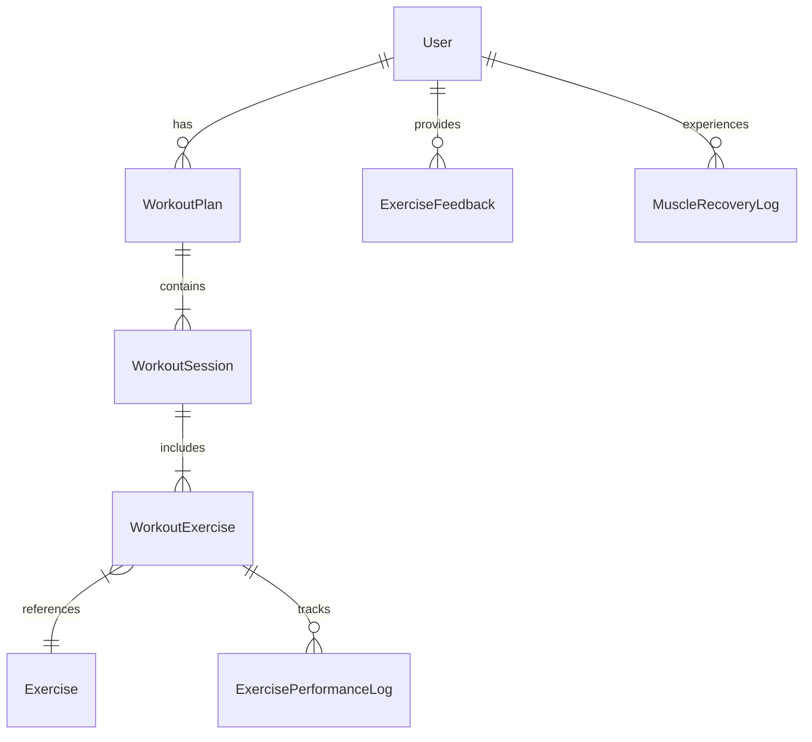

# Database Schema Documentation

## Overview

Flex uses **PostgreSQL** as its relationship database system, managed via **Prisma ORM**. The schema is defined in `prisma/schema.prisma`.

## 🗄️ Core Models

### User Management
- **`User`**: The central entity. Stores Credentials (hashed) and Profile data.
- **`RefreshToken`**: Handles session persistence. Has a One-to-Many relation with User (though typically one active per device).

### Exercise Library
The "Static" data, primarily seeded by the system but extensible.
- **`Exercise`**: Defines a movement (Bench Press, Squat).
  - `type`: Strength, Cardio, etc.
  - `difficultyMin/Max`: For scaling difficulty.
  - `defaultSets/Reps`: Baseline programming.
- **`Equipment`**: (e.g., Dumbbell, Barbell). Many-to-Many with Exercise via `ExerciseEquipment`.
- **`Muscle`**: (e.g., Pectoralis Major). Many-to-Many with Exercise via `ExerciseMuscle`. Muscles have roles (`PRIMARY` vs `SECONDARY`).
- **`Split`**: Categorization like "Push", "Pull", "Legs". Essential for the `WorkoutGenerator` to build split-based routines.

### Workout Tracking (The "Dynamic" Data)
- **`WorkoutPlan`**: A generated multi-week schedule.
  - Contains multiple `WorkoutSession`s.
  - Status: `ACTIVE` or `ARCHIVED`.
- **`WorkoutSession`**: A single day's workout.
  - `weekNumber`, `dayNumber`.
  - `isCompleted`: Boolean flag triggered by `logSession`.
- **`WorkoutExercise`**: The specific prescription for that day.
  - Links `Exercise` to `WorkoutSession`.
  - Stores the *Prescribed* Sets/Reps/Weight (calculated by the Generator).

### Performance & Feedback
- **`ExercisePerformanceLog`**: The actual data recorded by the user.
  - Links to `WorkoutExercise`.
  - Stores `actualReps`, `weight`, `rpe`.
  - **CRITICAL**: This table is the input for the Adaptive Algorithm.
- **`WorkoutSessionLog`**: High-level session data (Duration, total difficulty).
- **`ExerciseFeedback`**: User preference overrides.
  - `preference`: `LIKE`, `DISLIKE`, or `AVOID`.
  - `AVOID` triggers the Generator to exclude this exercise entirely.
- **`MuscleRecoveryLog`**: Fatigue tracking.
  - `fatigueLevel` (0-10).
  - Used to regulate volume (reduce sets) if fatigue is high.

## 📐 Key Relationships



## 🔄 Migrations

We use Prisma Migrate for schema changes.

**Creating a Migration:**
```bash
npx prisma migrate dev --name <descriptive_name>
```

**Applying Migrations (Production):**
```bash
npx prisma migrate deploy
```

## ⚠️ Notes

- **Cascading Deletes**: Most User-owned data cascades on delete. If you delete a User, their Plans, Logs, and Feedback are verified to be deleted.
- **UUIDs**: We use UUIDs for all primary keys to avoid enumeration attacks and allow easy database merging if ever needed.
